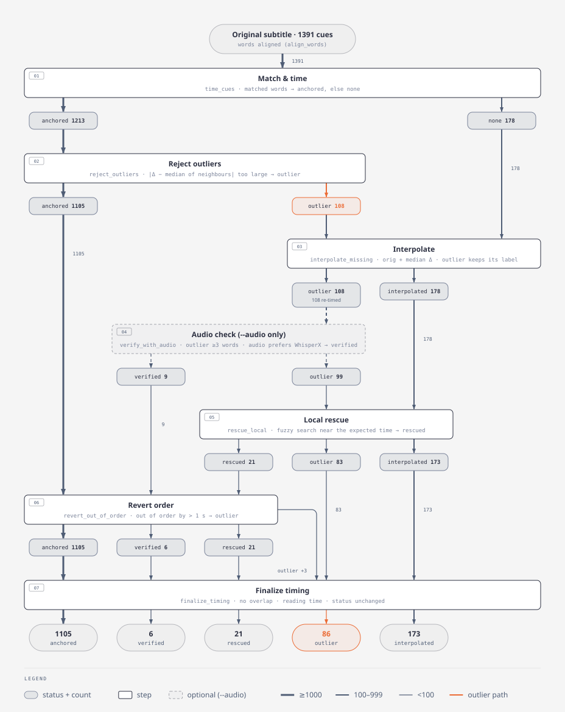
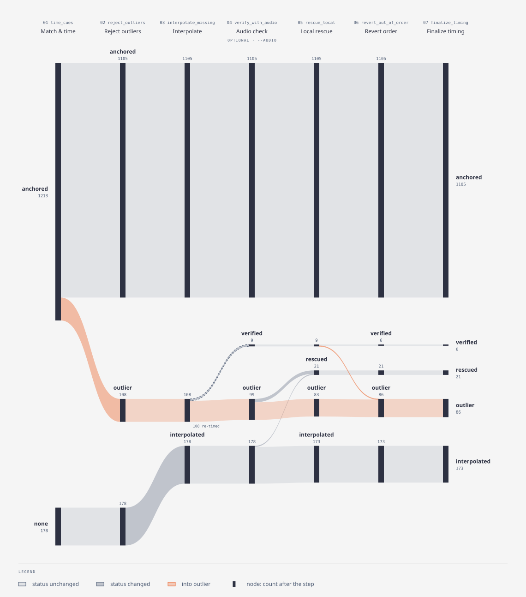

# SubRetime

Retime a subtitle line by line: keep its text, take precise times from the
speech.

SubRetime takes a subtitle whose words are right but whose timing is a bit
off, and finds when its words are actually spoken, in one of two ways (see
[Approaches](#approaches)):

- **Approach 0** (default): a WhisperX transcript of the same video has a
  timestamp for every spoken word; SubRetime matches it to the subtitle
  word by word.
- **Approach A** (`--force-align`): no transcript; the subtitle's own text
  is force-aligned to the audio.

Each subtitle line then gets the time its words are spoken. The text, line
breaks and formatting (`<i>`, `♪`) are kept exactly.

Real example from *Dog Man* (2025): the downloaded subtitle showed a line
a full second before it was said.

```text
downloaded              00:03:11,674 --> 00:03:13,710   You know I got you, buddy.
SubRetime, Approach 0   00:03:12,664 --> 00:03:14,265   You know I got you, buddy.
```

What it is **not**:

- not transcription: it never changes the subtitle's words;
- not a global shift like ffsubsync: every line gets its own time;
- not translation-aware: the subtitle must be in the spoken language.

The previous Chinese README is kept as [README.zh.md](README.zh.md)
(outdated, for reference).

## Approaches

Two approaches exist side by side; the DVC pipeline runs both and keeps
both outputs. Both are `align_srt.py` and share every step after the
words have times; they differ only in where those words come from.
WhisperX itself runs in two stages: Whisper writes the text, then a
wav2vec2 forced aligner finds when each word of that text is spoken.

| | Approach 0: transcript matching | Approach A: forced alignment (`--force-align`) |
|---|---|---|
| Timed words | WhisperX's: Whisper's text, wav2vec2 times | the subtitle's own text, given to WhisperX's second stage (wav2vec2) instead of Whisper's |
| Needs | a WhisperX transcript (`--audio` optional) | `--audio`, and a subtitle with roughly right times: the original itself or ffsubsync's |
| Weak where | the transcript differs from the subtitle, or repeats a line | the subtitle does not say exactly what is spoken (shortened lines, dropped interjections, songs); a window holding other speech still gets an answer, a wrong one (LESSONS.md §5) |

Approach A therefore never aligns over a wide window: it aligns
consecutive lines together in short windows around the subtitle's times,
and a line whose word confidence is low contributes no words, so the
pipeline places it like a line Whisper did not hear (see
[Approach A](#approach-a-forced-alignment)). The rest of this README
describes Approach 0 unless it says otherwise.

## Features

- **Word-level timing** from the WhisperX `.json` (Approach 0) or from
  force-aligning the subtitle's own words (Approach A).
- **Keeps the original text and formatting**, including italics and music
  notes.
- **Safe fallbacks**: lines without timed words, or timed implausibly,
  keep the original time corrected by the local offset instead of being
  forced onto a wrong time.
- **Optional audio check** (`--audio`): disputed lines are settled by
  checking which candidate time actually fits the sound.
- **Per-line report** (`.report.csv`) saying how each line was timed and
  which ones deserve a manual look.
- **No tuning parameters.** Thresholds are measured defaults (see
  [Key constants](#key-constants)).

## Requirements

- Windows or Linux, Python 3.11 or newer (tested on 3.13)
- FFmpeg on `PATH`
- For WhisperX: an NVIDIA GPU with a CUDA build of PyTorch is strongly
  recommended; CPU works but is much slower
- `--audio` also uses the GPU (it loads the WhisperX alignment model)

## Installation

```powershell
cd E:\me\subtitle-alignment-with-Whisper
uv venv                                  # or: python -m venv .venv
.\.venv\Scripts\Activate.ps1
winget install Gyan.FFmpeg               # skip if ffmpeg -version already works
uv pip install -r requirements.txt       # whisperx, srt, rapidfuzz
```

Verify that PyTorch sees the GPU:

```powershell
python -c "import torch, whisperx; print(torch.__version__, torch.cuda.is_available())"
```

If it prints `False`, WhisperX installed a CPU-only PyTorch. Reinstall the
**same version** from the CUDA index, e.g.:

```powershell
uv pip install torch==2.8.0 torchaudio==2.8.0 --index-url https://download.pytorch.org/whl/cu128
```

Version pitfalls (RTX 50-series, TorchCodec, FFmpeg DLLs, encodings) are in
[TROUBLESHOOTING.md](TROUBLESHOOTING.md).

## Usage

### Regular

Run the tools by hand on one video.

#### 1. Transcribe the video with WhisperX

```powershell
whisperx "F:\Videos\movie.mp4" --language en --model large-v3 --device cuda --compute_type float16 --output_dir "F:\Videos\whisper-output"
```

This writes `.json`, `.srt`, `.vtt`, `.tsv` and `.txt`. Keep the `.json`:
it is the only one with per-word times.

#### 2. Retime the subtitle

```powershell
python align_srt.py original.srt "F:\Videos\whisper-output\movie.srt" fixed.srt --audio "F:\Videos\movie.mp4"
```

- The second argument may be the WhisperX `.json` or `.srt`. With an
  `.srt`, the `.json` of the same name next to it is used automatically.
- `--audio` is optional but recommended when a GPU is available. A feature
  film takes about 1–2 minutes with it (mostly loading the audio and the
  alignment model), versus under a second without.
- `--quiet` prints only the summary; `--report path.csv` changes where the
  report goes (default: next to the output).

Use the subtitle **as downloaded**. Running ffsubsync first is only needed
when the original is off by more than about 10–20 s or runs at a different
speed (e.g. 25 vs 23.976 fps); it also strips `<i>` and `♪`.

#### 3. Check the result

```powershell
python evaluate_timing.py original.srt fixed.srt --audio "F:\Videos\movie.mp4"
```

Then open the video and `fixed.srt` in Subtitle Edit and review the lines
the report flags (see [Output](#output)).

#### Approach A: without a transcript

Skip step 1 and give `--force-align` a subtitle in place of the WhisperX
file: its text is force-aligned to the audio near its times.

```powershell
python align_srt.py original.srt original.srt fixed-A.srt --force-align --audio "F:\Videos\movie.mp4"
python align_srt.py original.srt movie.synced-by-ffsubsync.srt fixed-A.srt --force-align --audio "F:\Videos\movie.mp4"
```

The second argument is the original itself, or ffsubsync's subtitle when
the original's times are off by more than about a second. The output and
report are the same as Approach 0's. In `gui.py`, pick **A: force-align a
subtitle**.

#### GUI

```powershell
python gui.py
```

Pick the original subtitle, the WhisperX file and the output path. Tick
**Audio check** and pick the video to run with `--audio`. With
**Approach A**, the second file is the subtitle whose text and times are
force-aligned (the original or ffsubsync's), and the video is required
(`--force-align --audio`). The alignment
runs in the background, so the window stays responsive; a dialog shows the
summary when it finishes.

### DVC

Run the whole chain (transcribe → align → evaluate) on the test films and
compare runs. This needs the one-time setup in
[Development workflow (DVC)](#development-workflow-dvc). Activate `.venv`
first: the stages call `python` and `whisperx` from `PATH`, and a system
Python without the dependencies fails with `No module named 'srt'`.

```powershell
.\.venv\Scripts\Activate.ps1
cd lab
dvc repro
```

All commands run inside `lab/`.

| Goal | Command |
|---|---|
| Run what changed | `dvc repro` |
| Run one approach only | `dvc repro evaluate` (Approach 0) or `dvc repro evaluate_A` (A) |
| Choose the films that run | `python pick_films.py` (window) or `python pick_films.py <film id> ...` |
| Run one selected film only, once | `dvc repro evaluate@ann-droid-s01e01` (also runs the stages it depends on) |
| Current metrics | `dvc metrics show` |
| Metrics vs the last commit | `dvc metrics diff` |
| Record a code change as a named experiment | `dvc exp run -n reject-1.2s` |
| Try a different tuning constant | `dvc exp run -S align.reject_outliers_audio.strong_dev=1.2 -n reject-1.2s` |
| Compare all experiments | `dvc exp show`, or the **Experiments** table in VS Code |
| Keep an experiment's code and results | `dvc exp apply <name>`, then commit |
| Charts: shift of every line after each step | `dvc plots show` (writes `dvc_plots/index.html`), or **Plots** in VS Code |
| Where the lines went, step by step | open `out/<film>/diagrams/sankey.html` or `flowchart.html` |
| What one step changed | filter `out/<film>/changes.csv` by `step`, e.g. `05_rescue_local` |

After a `dvc repro` that failed partway, DVC may not have written the
`.gitignore` entries for the stages that did finish, and `git status` then
lists outputs such as `out/<film>/fixed.srt`. Run `dvc commit -f` to write
them before committing; otherwise run outputs end up in git.

`dvc exp run` takes a copy of the uncommitted code with each run, so trying a
change does not need a commit first. In the VS Code **Experiments** table,
tick the runs to compare; the **Plots** view then draws their per-step
charts side by side.

## Output

- `fixed.srt`: the retimed subtitle, UTF-8.
- `fixed.report.csv`: one row per line.

Both approaches write the same files with the same columns and statuses.
"WhisperX words" below means the timed words the line was matched with:
the transcript's in Approach 0, the force-aligned subtitle words in
Approach A (column names keep `whisper` for both).

| Column | Meaning |
|---|---|
| `index` | line number in the original subtitle |
| `status` | how the line was timed (below) |
| `matched_words` / `words` | subtitle words paired with WhisperX words / total |
| `orig_start` | original start time (s) |
| `new_start`, `new_end` | output times (s) |
| `shift_s` | `new_start − orig_start` |
| `text` | subtitle text |
| `whisper_text` | the WhisperX words used |
| `notes` | why: rejected offsets, audio scores, rescues, pushes |

| Status | Meaning | Review? |
|---|---|---|
| `anchored` | timed from matched WhisperX words | no |
| `verified` | WhisperX time was rejected, then restored by the audio check | rarely |
| `rescued` | found again by a local search near the expected time | spot-check |
| `outlier` | WhisperX time rejected; original time + local offset | **yes** |
| `interpolated` | no words matched (interjections, songs); original time + local offset | long runs |
| `none` | nothing matched anywhere; original time kept | **yes** |

On *Dog Man* (1391 lines), Approach 0: 1105 anchored, 6 verified,
21 rescued, 86 outliers, 173 interpolated. Approach A (original's text):
1136 anchored, 6 verified, 8 rescued, 24 outliers, 217 interpolated.

### Approach A: forced alignment

With `--force-align`, `force_align_words()` replaces loading the WhisperX
file; every later step is Approach 0's, so the output, report and statuses
are the same. It groups consecutive lines of the given subtitle into
windows of at most 15 s, cut at its gaps (`_windows`), adds 0.5 s on each
side, and aligns each window's text with `AudioJudge.align_words` (the
WhisperX alignment model `--audio` already loads; answers go to the same
`--audio-cache`). A line contributes no words when:

| Status in `00_force_align.csv` | Meaning |
|---|---|
| `kept` | its words go to the pipeline |
| `low_score` | mean word confidence under 0.5 (0.6 for lines under 3 words) |
| `out_of_order` | starts before the previous kept line ends (windows overlap by their padding) |
| `failed` | the aligner returned no times |
| `no_words` | nothing to align (`♪`) |

Such a line is then placed like one Whisper did not hear: interpolated
from its neighbours' offset, or found again by `rescue_local`.

Measured on *Dog Man* (1391 lines):

- Score as a detector: every window was aligned again 3 s late. Of the
  3+ word lines that moved more than 1 s, the threshold 0.5 keeps 18%,
  and it keeps 91% of correctly placed lines; the true placement scored
  higher for 634 of 665. For 1-2 word lines the score separates poorly
  (0.6 keeps 16% of misplaced, 64% of correct), as the audio judge does
  (LESSONS.md §5).
- On lines Approach 0 anchored, forced alignment of the subtitle's text
  near Approach 0's times starts 0.01 s (median) from Approach 0, and
  under 0.23 s for 90% of lines: both are wav2vec2 word times.
- Audio test against ffsubsync (lines starting more than 1 s apart):

  | Words from | Kept lines | Disputed | Wins | Losses | Ties | Unjudged |
  |---|---|---|---|---|---|---|
  | Approach 0: WhisperX transcript | – | 19 | 3 | 3 | 4 | 9 |
  | Approach A: original's text and times | 1160 | 14 | 4 | 4 | 2 | 4 |
  | Approach A: ffsubsync's text and times | 1170 | 16 | 6 | 2 | 1 | 7 |

  The ffsubsync row is not independent: ffsubsync is also the reference
  the disputes are counted against. The DVC pipeline uses the original.

## Development

### Tech stack

| Component | Library | Role |
|---|---|---|
| Transcription + word times | WhisperX (Whisper + wav2vec2 forced alignment) | spoken words with start/end times |
| Subtitle I/O | `srt` | parse and write SRT |
| Exact word alignment | `difflib.SequenceMatcher` (standard library) | global, in-order word pairing |
| Fuzzy word similarity | `rapidfuzz` (`fuzz.ratio`) | spelling variants inside gaps |
| Audio check | WhisperX `align()` (wav2vec2, CTC) | which of two times fits the sound |
| GUI | `tkinter` | file pickers around the CLI |

### Core idea

Align **words, not lines**. Both the subtitle and the WhisperX transcript
become word sequences, and one global, in-order alignment pairs them for
the whole film at once, so no single mistake can drag later lines along.
Each line then starts at its first matched word and ends at its last.

Neither source is trusted blindly. WhisperX word times occasionally fail
(words smeared over many seconds during music, a whole segment placed
early), and the original subtitle is typically 0.2–0.5 s off per line. The
original's local offset is the prior; WhisperX times are accepted only
where they roughly agree with it, and disagreements are settled by audio
when available.

The steps fall into four kinds: **structure** limits how badly anything
can go wrong, **checks** detect errors, **evidence** decides between
candidates, and **repair / fill** supplies a time when WhisperX's is missing
or rejected.

### Pipeline

`align_subtitles()` in `align_srt.py` runs these steps in order, for both
approaches. Before them, Approach A makes the timed words by forced
alignment (`force_align_words`, snapshot `00_force_align.csv`); Approach
0 loads them from the WhisperX `.json` (`load_whisper_words`).

| # | Step | Function | Kind |
|---|---|---|---|
| 0 | Normalize and split both texts into words; exact word matching, global and in order; fuzzy matching inside the gaps between exact matches (similar words, 2:1 joins such as "dog man" / "dogman") | `tokenize`, `align_words` (difflib), `_fuzzy_gap` | structure, repair |
| 01 | Time each line from its first and last matched word; drop a first/last word pinned seconds away from the rest | `time_cues`, `_trim_edge_words` | check |
| 02 | Reject WhisperX times far from the neighbours' median offset; stricter for weakly matched lines | `reject_outliers`, `_is_strong` | check |
| 03 | Fallback time for rejected and unmatched lines: original time + median local offset | `interpolate_missing` | fill |
| 04 | `--audio` only: restore a rejected time if the audio clearly prefers it (lines with 3+ words) | `verify_with_audio`, `AudioJudge` | evidence |
| 05 | Search again for unplaced lines within ±1.5 s of the fallback time | `rescue_local` | repair |
| 06 | Revert lines that break the subtitle order, then re-interpolate | `revert_out_of_order` | check |
| 07 | No overlaps, minimum reading time, small start adjustments | `finalize_timing` | finishing |

Steps 01–07 are numbered like the snapshot files (`out/<film>/steps/NN_<step>.csv`).
Step 0 writes `00_align_words.csv`, which is per word rather than per line
(see [Development workflow](#development-workflow-dvc)). Step 06 exists because steps 02–05 edit times
line by line and can undo the ordering that step 0 guarantees.

Each step handles only some statuses and lets the others pass by. The
flowchart shows which step each status goes through (one column per
status); the Sankey shows how many lines take each path, one column per
step. Both use the *Dog Man* run (1391 lines, `--audio`); open an image for
full size. `lab/flow_diagrams.py` computes them from a run's snapshots, and
the DVC stage `diagrams@<film>` redraws them after every `align`
(`out/<film>/diagrams/`). The copies below are refreshed by hand:

```powershell
cd lab
python flow_diagrams.py out/dog-man-2025 --out docs/diagrams/dog-man-2025 --title "Dog Man (2025)"
```

<p align="center">
  
</p>

<p align="center">
  
</p>

### Key constants

These are the real knobs, measured with Approach 0 and shared by Approach A
(whose own constants are under [Approach A](#approach-a-forced-alignment)).
Each value was chosen by measurement on
*Dog Man* (see LESSONS.md); change one only with `evaluate_timing.py`
before and after. For development, most of them can be overridden without
editing code: `align_srt.py --params FILE` reads the `align` section of a
YAML file, and the DVC pipeline passes `lab/params.yaml` (see
[Tuning constants](#tuning-constants)).

| Constant | Value | Where | Why |
|---|---|---|---|
| strong-line tolerance | 1.5 s (1.0 s with `--audio`) | `reject_outliers(strong_dev)` | gaps above ~3 s were WhisperX errors about 3× as often as original errors |
| weak-line tolerance | 1.0 s | `reject_outliers(weak_dev)` | a lone "no" / "okay" is easily paired with the wrong copy |
| strong line | 4+ matched words, or 3 covering ≥ 60% | `_is_strong` | enough words to trust the pairing |
| neighbour window | 8 anchored lines each side | `reject_outliers(window)` | median of enough lines to ignore a few bad ones |
| fallback median | 3 anchored lines each side | `interpolate_missing(side)` | one bad neighbour must not shift a whole run |
| edge-word gap | 1.5 s beyond the original duration | `time_cues(max_word_gap)` | real pauses inside a line are kept |
| fuzzy word similarity | 0.75 | `align_words(min_sim)` | `grampa`/`grandpa` yes, unrelated words no |
| fuzzy gap size limit | 4000 word pairs | `align_words(max_gap_cells)` | speed; larger gaps get exact matches only |
| rescue window / score | ±1.5 s / 85 | `rescue_local` | local search only, near-exact text |
| audio: minimum words | 3 | `AudioJudge.MIN_WORDS` | the audio test was validated only on 3+ word lines |
| audio: margin / window pad | 0.05 / 0.3 s | `verify_with_audio`, `AudioJudge.confidence` | smaller differences count as a tie |
| order tolerance | 1.0 s | `revert_out_of_order` | beyond both neighbours on one side = misplaced |
| reading time | 17 chars/s, min 0.8 s, gap 84 ms, max lead 0.5 s | `finalize_timing` | common subtitle guidelines |

### Evaluation

`evaluate_timing.py baseline.srt candidate.srt [...] --audio movie.mp4`
prints:

- **structure**: overlaps, order, lines under 0.7 s or over 7 s, reading
  speed above 25 characters/s;
- **a control test** of the audio judge: on lines where two timelines
  agree, does the true window beat the same window shifted by 3 s? Reported
  separately for 3+ word and shorter lines. Trust the next table only if
  the control passes;
- **disputes**: for lines whose starts differ by more than 1 s from the
  baseline, how often the audio prefers the candidate (wins / losses /
  ties / unjudged).

### Development workflow (DVC)

[DVC](https://dvc.org) runs the whole chain (transcribe → align → evaluate)
on a set of test films. It reruns only the stages whose code, inputs or
params changed, and it keeps every run's outputs and metrics so runs can be
compared. The DVC extension for VS Code shows the runs as a table, with
charts next to it.

The DVC project is the repository root (`.dvc/`, `.dvcignore`), so the VS
Code extension finds it without extra setup. Everything else DVC-related
lives in **`lab/`**: the pipeline files, the test subtitles and all outputs.
The rest of the repository does not depend on it. **Run every `dvc` command
from inside `lab/`**, so `dvc repro` and `dvc exp run` pick up
`lab/dvc.yaml`.

#### Install

These steps assume the normal [Installation](#installation) above is done
(`.venv` exists and WhisperX works).

1. Install DVC into the project environment:

   ```powershell
   .\.venv\Scripts\Activate.ps1
   uv pip install -r requirements-dev.txt    # or: python -m pip install -r requirements-dev.txt
   dvc --version
   ```

2. Optionally, turn off DVC's anonymous usage statistics for this project
   (the setting lives in `.dvc\config.local`, which is not committed):

   ```powershell
   cd lab
   dvc config --local core.analytics false
   ```

3. Install the VS Code extension, then open the repository folder in VS Code:

   ```powershell
   code --install-extension iterative.dvc
   code .
   ```

   In VS Code, run **Python: Select Interpreter** and pick
   `.venv\Scripts\python.exe`: the DVC extension finds the `dvc` command
   through the interpreter the Python extension uses. The DVC icon then
   appears in the activity bar. If it reports that DVC was not found, open
   **DVC: Setup the Workspace** and pick the same interpreter.
   (`.vscode\settings.json` already points `dvc.pythonPath` at it.)

4. Pick a **film id** for each test video: lowercase words joined by `-`
   that name exactly one video, with the year for a film and the episode for
   a series (`dog-man-2025`, `ann-droid-s01e01`), so `ann-droid-s01e02` can
   be added later without a clash.

5. Put each film's subtitles in `lab\films\<film id>\`. They are ordinary
   files, not ignored by git; once committed, a clone brings them along and
   git keeps their history. (The current test subtitles are not committed
   yet, so a fresh clone has to add its own.)

   ```powershell
   New-Item -ItemType Directory -Force lab\films\dog-man-2025
   Copy-Item -LiteralPath "F:\Videos\Subs\English.srt" lab\films\dog-man-2025\original.srt
   Copy-Item -LiteralPath "F:\Videos\Subs\movie.synced-by-ffsubsync.srt" lab\films\dog-man-2025\ffsubsync.srt
   ```

   Videos stay where they are: they are too large for the repository, and
   DVC still records their hash as a stage input.

6. List every test film in `lab\films.yaml` (paths there are relative to
   `lab/`); WhisperX settings shared by all films are in `lab\params.yaml`.

   | Key | Meaning |
   |---|---|
   | `<id>.video` | the video (audio source for WhisperX and `--audio`); an absolute path is fine |
   | `<id>.original` | the subtitle to retime, as downloaded, e.g. `films/dog-man-2025/original.srt` |
   | `<id>.baseline` | reference timeline for `evaluate_timing.py`, e.g. `films/dog-man-2025/ffsubsync.srt` |
   | `<id>.whisper` | optional: a WhisperX transcript folder of the film's own (a [sample](#sample-films-for-debugging) has one); the film then skips the transcribe stage. Default: `work/<id>/whisper`, written by that stage |
   | `whisper.*` (params.yaml) | WhisperX model, language, device, compute type |

   Then choose which of them run (see [Choosing films](#choosing-films)):

   ```powershell
   cd lab
   python pick_films.py dog-man-2025
   ```

   Each selected film gets its own stages: `transcribe@<film id>`,
   `align@<film id>`, `diagrams@<film id>` and `evaluate@<film id>`
   (Approach 0), and `align_A@<film id>`, `diagrams_A@<film id>` and
   `evaluate_A@<film id>` (Approach A, which needs no transcript).

7. Optional: reuse an existing WhisperX transcript instead of spending
   about 10 minutes per film on the transcribe stage. Copy its `.json` into
   `lab\work\<film id>\whisper\` and record it as that stage's output:

   ```powershell
   cd lab
   New-Item -ItemType Directory -Force work\dog-man-2025\whisper
   Copy-Item -LiteralPath "F:\Videos\whisper-output\movie.json" -Destination work\dog-man-2025\whisper\
   dvc commit -f transcribe@dog-man-2025
   ```

8. Run the pipeline:

   ```powershell
   cd lab
   dvc repro
   ```

   The first run of the align and evaluate stages takes a few minutes per
   film: both load the audio and the alignment model.

DVC has already been initialized and committed (`.dvc/`, `.dvcignore` at
the repository root), so a fresh clone needs only the steps above. No DVC
remote is configured: transcripts and outputs exist only in this machine's
cache (`.dvc\cache`) and are rebuilt by `dvc repro` elsewhere.

#### Files in `lab/`

| File | Purpose |
|---|---|
| `dvc.yaml` | stages `transcribe`, `align`, `diagrams`, `evaluate` (Approach 0) and `align_A`, `diagrams_A`, `evaluate_A` (Approach A), repeated per film (`foreach`): commands, inputs, outputs, metrics, plots |
| `films.yaml` | every test film: video, subtitle, baseline (edited by hand, or appended by `pick_films.py`'s **Choose video…**) |
| `selection.yaml` | the films that run, copied from `films.yaml` by `pick_films.py` (generated; committed) |
| `pick_films.py` | choose the films to run, in a window or on the command line |
| `make_sample.py` | cut a few minutes of a film into a sample film, for the debugger (below) |
| `stops.yaml` | where the **step through film** debug configuration pauses (below) |
| `debug_film.py` | run `align_srt.py` on a film selected in `pick_films.py`, for VS Code's debugger (below) |
| `params.yaml` | WhisperX settings and `align_srt.py` tuning constants used by `dvc.yaml` (`align.force_align`: Approach A only) |
| `dvc.lock` | hashes of each stage's inputs and outputs from the last run (committed; DVC maintains it) |
| `films/<film>/original.srt`, `ffsubsync.srt` | the test subtitles (committed) |
| `films/<sample>/whisper/` | a sample's WhisperX `.json`, cut from its film's (committed) |
| `work/<film>/whisper/` | WhisperX `.json` (git-ignored, stored in DVC's cache) |
| `out/<film>/fixed.srt`, `fixed.report.csv` | the retimed subtitle and its report |
| `out/<film>/steps/NN_<step>.csv` | **snapshot**: the per-line state after each step of `align_subtitles()` |
| `out/<film>/steps/00_align_words.csv` | **word snapshot**: input and output of `align_words`, one row per word (below) |
| `out/<film>/changes.csv` | every line each step changed, before → after |
| `out/<film>/A/` | Approach A: the same files as `out/<film>/` (`fixed.srt`, report, `steps/`, `changes.csv`, `diagrams/`, `align.json`, `eval.json`), plus `steps/00_force_align.csv`: each line's confidence and whether its words were kept; `align.json` adds `force_<status>` counts |
| `cache/<film>/confidence.sqlite` | audio judge scores and Approach A's forced alignments, reused across runs (git-ignored, not a DVC output) |
| `debug/<film>/` | outputs of the VS Code debug configuration (git-ignored) |
| `out/<film>/align.json` | metrics: lines per status, share of subtitle words matched (committed) |
| `out/<film>/eval.json` | metrics: `evaluate_timing.py` results (committed) |
| `flow_diagrams.py` | draws `out/<film>/diagrams/`: flowchart and Sankey of the run's status flow, from its snapshots (HTML and SVG) |
| `out/<film>/diagrams/` | output of `flow_diagrams.py` for that run (stage `diagrams`) |
| `docs/diagrams/` | committed diagrams used by README.md: a copy of one run's `diagrams/`, plus hand-drawn state machine, swimlane and heatmap |

Outputs other than the metrics files are git-ignored. DVC keeps them in its
cache, one copy per run.

These files come from development options of `align_srt.py`, which also
work outside DVC:

| Option | Writes |
|---|---|
| `--snapshots DIR` | one CSV per step: every line's state after that step; plus `00_align_words.csv`: both word streams merged in order, each original word with the WhisperX word(s) it matched, how (`kind`: exact, fuzzy, split, join, or unmatched), and the gap between exact runs it fell in (`gap`: `tried`, `skipped` because larger than `max_gap_cells`, or `one_sided`). The columns are described in `write_word_snapshot` |
| `--changes FILE` | one CSV row per line a step changed: step, status and start/end before → after, how far it moved (`moved_s`), and the step's notes (e.g. `audio: whisper 0.62 vs prior 0.29`). The "before" of the first step is the original subtitle's time; a line without a time yet appears once a step gives it one |
| `--metrics FILE` | the status counts |
| `--params FILE` | nothing: reads tuning constants (next section) |
| `--audio-cache FILE` | an SQLite cache of the audio judge's scores (below); `evaluate_timing.py` has the same option |

**Audio cache.** Almost all of the align stage's time is audio work: on
Dog Man, loading the audio took 8.9 s, the alignment model 4.0 s and the
178 audio-judge calls 8.4 s, while every other step together took about
0.1 s. With `--audio-cache`, each judge answer is stored under its video
(path, size, modification time), WhisperX version, device, text, start,
duration and padding, and the audio and model are loaded only when a
question is not in the cache yet. A rerun that asks the same questions
(e.g. after changing `finalize_timing`) skips all of it, and so does every
evaluation, whose 240-call control test is the same each time. The
pipeline keeps it in `lab/cache/<film>/confidence.sqlite`, git-ignored and
deliberately not a DVC output (DVC deletes outputs before a run). Delete
the folder to start fresh; bump `AudioJudge.CACHE_VERSION` when
`AudioJudge.confidence` changes.

#### Tuning constants

The `align` section of `lab/params.yaml` holds the main tuning constants of
`align_srt.py`, as `{step: {keyword: value}}`. Each step is a function in
`align_srt.py`, and each keyword is one of its arguments:

```yaml
align:
  rescue_local:
    time_window: 1.5
    min_score: 85
```

The values equal the defaults in the code, so without `--params` (and for
every end user) nothing changes. `reject_outliers_audio` holds the
tolerances used when `--audio` is on, which the pipeline always uses. Any
other keyword argument of the steps listed in `TUNABLE` (in `align_srt.py`)
can be added the same way; a misspelled step or keyword stops the run
before any audio is loaded.

Because the `align` stages list `align` under `params`, DVC reruns them when
a value changes, and each value is a column in `dvc exp show` and the VS
Code Experiments table. Try a value without editing the file:

```powershell
dvc exp run -S align.rescue_local.time_window=2 -n rescue-2s
```

#### Daily loop

The commands for running the pipeline are under [Usage → DVC](#dvc).

#### Choosing films

DVC runs every film in `lab/selection.yaml`. That file is generated from
`films.yaml` by `pick_films.py`, because DVC's templates cannot pick entries
by a parameter (`films[<param>]` is not supported). `dvc.yaml` loads it
through `vars` and repeats its stages for each film with `foreach`. It
holds two lists: `films` (align and evaluate run over it) and `transcribe`,
the films among them without a `whisper` transcript of their own.

```powershell
cd lab
python pick_films.py                     # window: a checkbox per films/ folder
python pick_films.py ann-droid-s01e01    # no window: write the selection
```

The window lists the folders in `lab/films/`; tick any number of them (**All**
/ **None** tick or clear every one). A folder that `films.yaml` does not
describe yet is greyed out, with a **Choose video…** button beside it: pick
the film's video, and the window appends an entry for the folder to the end
of `films.yaml` (as text, so the file's comments stay) and makes the row
tickable. The folder must hold `original.srt`; if it has no `ffsubsync.srt`,
the window offers to pick another `.srt` as the baseline, and uses
`original.srt` if you decline or cancel. A `whisper/`
folder inside it becomes the entry's `whisper` transcript. Paths are written
with forward slashes and in quotes, relative to `lab/` when they are under
it. **Save selection** writes `selection.yaml`;
**Save and run dvc repro** also runs the pipeline and shows its output.
Until the first output line, the log area explains these buttons.
The window puts its own interpreter's folder first on `PATH`, so the stages'
`python` and `whisperx` are the ones in `.venv`, even when the window was
started without activating `.venv`.

A film you leave out keeps its entries in `dvc.lock` and its outputs in
DVC's cache. Selecting it again costs nothing if its inputs and the code are
unchanged since its last run; otherwise it reruns on the next `dvc repro`.

To choose what you *look at* in VS Code, among the films that ran:

- **Plots**: run **DVC: Select Plots to Display** from the Command Palette
  (Ctrl+Shift+P). It lists one entry per `out/<film>/steps/<step>.csv`;
  tick the films and steps to show.
- **Experiments** table: the metric columns are grouped by file,
  `out/<film>/align.json` and `out/<film>/eval.json`. Run **DVC: Select
  Columns to Display in the Experiments Table** and untick the other films.

To add a step, write the function, call it in `align_subtitles()`, and add
a `snapshot("<name>")` call after it. Later snapshot numbers shift by one,
so compare snapshots by step name rather than by number across runs.
`00_align_words.csv` is written directly, not through `snapshot()`, so it
does not move the line snapshots' numbers. In the Plots view its
`shift_s` is per word (the line's shift plus the word's place in the line),
so it scatters more than the line snapshots.

#### Sample films for debugging

A full film is too long to step through `align_subtitles()` in a debugger.
`make_sample.py` cuts the cues you want to study, plus context, out of a
film that has already run, into a test film of its own:

```powershell
cd lab
python make_sample.py dog-man-2025 1092 1151
```

The folder is named after the cues to study,
`films/dog-man-2025-sample-1092-1151/`, but holds more: `reject_outliers`
compares a line with the 8 anchored lines on each side (`window`), and
`interpolate_missing` times lines from their anchored neighbours however
far away they are, so with less context the studied lines would end up
differently than in the full film. The script widens the cut until each
side holds 8 lines the film still had anchored after `reject_outliers`
(`--anchors`; the default is the larger of `window` and
`interpolate_missing`'s `side` in `params.yaml`). For Dog Man 1092-1151
that is cues 1076-1161. The entry it prints for `films.yaml` says so in a
comment.

Times and cue numbers stay the film's, so the sample's snapshots line up
with the film's row by row, and the audio judge asks the same questions of
the same video. The WhisperX words are the ones the film's word alignment
(`00_align_words.csv`) left between the cues before and after the cut, not
the ones inside a time span: those would give the edge lines words that
belong to their neighbours.

After cutting, the script aligns the sample (with the film's audio cache)
and compares each step's snapshot with the film's: a difference on a
studied line is an error that asks for more `--anchors`; one on a context
line is only reported. The committed sample matches on every studied line
and covers every status change the full film has (anchored → outlier,
none → interpolated, outlier → verified, outlier/interpolated → rescued,
verified → outlier).

#### Stepping through a film in VS Code

Start one of the two configurations in VS Code's Run and Debug view
(`.vscode/launch.json`):

| Configuration | Pauses |
|---|---|
| **step through film (stops.yaml)** (F5's default) | where `lab/stops.yaml` says (below), and at your breakpoints |
| **align film (no stops)** | only at your breakpoints |

Both run `lab/debug_film.py`, which asks in the terminal which of the films
selected in `pick_films.py` to debug, and with which approach:

```text
Films selected in pick_films.py:
  1) dog-man-2025-sample-1092-1151
  p) select other films (opens the pick_films window)
Film to debug [1]:
Approach: 0 = WhisperX transcript, A = force-align the subtitle [0]:
```

`p` opens the `pick_films` window; tick other films and press **Save
selection** (or **Save and run dvc repro** for films that have not run
yet). Saving closes the window (a run, once it ends with exit code 0;
a failed run leaves it open to read), and the list is asked again.
Closing the window by hand does the same without saving. A film without a transcript yet is marked
and cannot be chosen for Approach 0 until it has run. `debug_film.py` then
passes the `align` stage's arguments for the film (from `selection.yaml`),
or `align_A`'s for Approach A, writes to `lab/debug/<film>/` (Approach A:
`lab/debug/<film>/A/`; git-ignored), and uses the pipeline's audio cache,
so after one `dvc repro` of the film the video and the GPU are never
loaded. `python lab/debug_film.py <film>` (Approach 0) or
`python lab/debug_film.py <film> A` skips the questions.
[`lab/docs/sample-walkthrough.md`](lab/docs/sample-walkthrough.md) says
where to stop and which lines to watch at each step of the sample.

`lab/stops.yaml` lists the steps and, optionally, the lines (cue numbers of
the picked film) to pause on:

```yaml
steps: [reject_outliers, verify_with_audio, revert_out_of_order]   # or [all]
cues: [1134]
```

Each step of `align_srt.py` calls `stop_for_debug(step, cue)` where it
decides about a line. The function comes from `dev_stops.py`, which calls
`breakpoint()` when the file asks for that step and line, and does nothing
when `SUBRETIME_STOPS` is not set. Only the first configuration sets it: do
not set it in a shell or system-wide, or `dvc repro`, `pick_films.py` and
`gui.py` would stop at an invisible pdb prompt. A misspelled step name
stops the run at startup. Without `dev_stops.py` next to it,
`align_srt.py` runs as before. On a full film, list `cues`: without them
every listed step pauses on every line.

### Project layout

| File | Purpose |
|---|---|
| `align_srt.py` | the retiming pipeline (CLI): Approach 0, or Approach A with `--force-align` |
| `evaluate_timing.py` | quality check against the audio |
| `gui.py` | Tkinter front end for `align_srt.py` |
| `dev_stops.py` | development: pause `align_srt.py` in the debugger at the steps and lines `SUBRETIME_STOPS` lists |
| `requirements.txt` | Python dependencies |
| `requirements-dev.txt` | development tools (DVC) |
| `lab/` | DVC development pipeline, test subtitles and run outputs (see [Development workflow](#development-workflow-dvc)) |
| `.claude/skills/status-flowchart/` | project skill: how the status flowchart and Sankey are drawn (`lab/flow_diagrams.py`) |
| `LESSONS.md` | what went wrong while building this, and why the design is what it is |
| `TROUBLESHOOTING.md` | installation and Windows problems |
| `README.zh.md` | the old Chinese README (outdated) |
